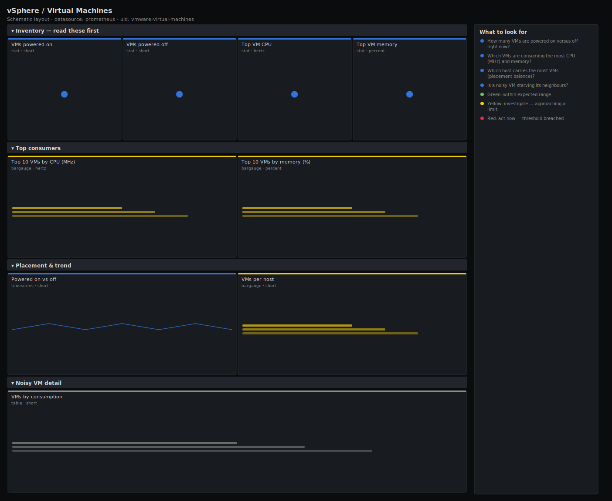

# vSphere / Virtual Machines

> Powered-on inventory, per-VM CPU and memory consumption, VM-to-host placement and the noisiest guests for vSphere VMs scraped by the pryorda vmware_exporter. Answers "how many VMs are running and which ones are eating the cluster?" rather than listing every guest counter.

**Primary search phrase:** vSphere virtual machines Grafana dashboard  
**Category:** `vmware` · **UID:** `vmware-virtual-machines` · **Datasource:** Prometheus



## Questions this dashboard answers

- How many VMs are powered on versus off right now?
- Which VMs are consuming the most CPU (MHz) and memory?
- Which host carries the most VMs (placement balance)?
- Is a noisy VM starving its neighbours?
- Did the powered-on count drop unexpectedly?

## Production lessons — why this dashboard exists

Cluster capacity problems usually trace back to a handful of **noisy VMs**, not a uniform rise across the fleet — so this dashboard leads with the powered-on count and a top-N of the heaviest CPU and memory consumers. Tracking powered-on vs powered-off over time catches two real incidents cheaply: a mass power-off (host failure or a bad orchestration run) shows up as a step down, and VM sprawl shows up as a slow climb that erodes your HA headroom. Per-host VM counts expose DRS imbalance before it concentrates risk on one host.

## Data source requirements

- **Prometheus** datasource (selected at import time via `${DS_PROMETHEUS}`).
- `vmware_exporter` (pryorda) pointed at vCenter (`vmware_vm_cpu_usage_mhz`, `vmware_vm_mem_usage_average`, `vmware_vm_power_state`, `vmware_vm_num_cpu`).
- Series carry `vm_name`, `host_name` and `cluster_name` labels. **State mapping assumption:** `vmware_vm_power_state == 1` is treated as *poweredOn* and `== 0` as *poweredOff*; adjust if your exporter encodes it differently. `vmware_vm_mem_usage_average` is the active-memory percentage reported by the `mem.usage.average` counter.

## Template variables

| Variable | Label | Type | Purpose |
|----------|-------|------|---------|
| `${cluster}` | Cluster | query | vSphere cluster(s) to display. |
| `${host}` | Host | query | ESXi host(s) whose VMs to display; supports multi-select. |

## Panels

### Inventory — read these first

- **VMs powered on** (stat, `short`) — Count of running VMs across the selection.
- **VMs powered off** (stat, `short`) — Count of stopped VMs — a sudden jump can mean a host failure or a bad automation run.
- **Top VM CPU** (stat, `hertz`) — Highest single-VM CPU consumption in MHz across the selection.
- **Top VM memory** (stat, `percent`) — Highest single-VM active-memory usage as a percent.

### Top consumers

- **Top 10 VMs by CPU (MHz)** (bargauge, `hertz`) — The biggest CPU consumers right now — your candidates for right-sizing or migration.
- **Top 10 VMs by memory (%)** (bargauge, `percent`) — The biggest active-memory consumers — watch these when host memory pressure rises.

### Placement & trend

- **Powered on vs off** (timeseries, `short`) — Running and stopped VM counts over time — a step change flags a host failure or orchestration error.
- **VMs per host** (bargauge, `short`) — Powered-on VM count per ESXi host — exposes DRS imbalance and concentration risk.

### Noisy VM detail

- **VMs by consumption** (table, `short`) — Per-VM CPU (MHz) sorted high to low, with host placement — the working list for right-sizing.

## Import

**Grafana UI** — *Dashboards → New → Import*, upload `dashboards/vmware/virtual-machines.json`, then pick your datasource when prompted.

**API:**

```bash
scripts/import-dashboard.sh dashboards/vmware/virtual-machines.json
```

**Provisioning** — drop the JSON into a provisioned folder (see [provisioning guide](../../provisioning.md)).

## Recommended alerts

Ready-to-use rules ship in `alerts/vmware.rules.yml`.

### VmwareVMHighMemoryUsage (`warning`)

```promql
vmware_vm_mem_usage_average > 90
```

- **Fires after:** `15m`
- **Why it matters:** A guest pinned near 100% active memory is likely swapping inside the OS, degrading its own performance and pressuring the host.
- **Investigate:** Open vSphere / Virtual Machines; check the VM's host memory pressure and whether the guest is under-provisioned.
- **Recovery:** Clears when the VM's active memory falls below 90% for 10m.
- **False positives:** Caching workloads (databases, JVMs) that intentionally use all assigned memory — exclude them by `vm_name`.

### VmwareNoPoweredOnVMs (`critical`)

```promql
count by (cluster_name) (vmware_vm_power_state == 1) == 0
```

- **Fires after:** `5m`
- **Why it matters:** No running VMs in a production cluster means either a mass outage or that the exporter has lost visibility — both are emergencies.
- **Investigate:** Confirm against vCenter directly; check the exporter's connection and vCenter health.
- **Recovery:** Clears when at least one VM reports powered-on for 5m.
- **False positives:** Lab or DR clusters intentionally powered down — exclude them by `cluster_name`.

### VmwareHostVMDensityHigh (`warning`)

```promql
max by (cluster_name) (count by (host_name, cluster_name) (vmware_vm_power_state == 1)) > 45
```

- **Fires after:** `30m`
- **Why it matters:** Heavy concentration of VMs on one host breaks HA headroom — losing that host overwhelms the rest of the cluster.
- **Investigate:** Open the VMs-per-host panel; check whether DRS is set to fully automated and is actually balancing.
- **Recovery:** Clears when no single host exceeds 45 powered-on VMs for 30m.
- **False positives:** Small VMs (VDI) where 45+ per host is by design — raise the threshold for those clusters.

## Troubleshooting

| Symptom | Likely cause | First action |
|---------|--------------|--------------|
| Powered-on count is 0 but VMs are running | Your exporter encodes power state differently (e.g. 1 = off). | Check the value mapping and flip the `== 1` / `== 0` comparisons to match. |
| CPU bargauge shows huge raw numbers | Reading MHz as Hz without scaling. | This spec multiplies by `1e6` and uses the `hertz` unit so Grafana shows MHz/GHz; keep that conversion. |
| Table is empty | Instant query returned nothing because no VM matches the host filter. | Reset `$host` to All; confirm `vmware_vm_cpu_usage_mhz` is scraped. |

## Performance considerations

vCenter samples VM counters on ~20s intervals, so a 1m refresh is sufficient and avoids hammering vCenter. Top-N panels use `topk(10, …)` and counts use `count by (host_name)` to bound series even on large inventories. Scope `$cluster` on big estates to keep the per-VM table responsive.

## Customization

Tune the per-host density and memory thresholds to your VM sizes and HA policy. Swap the CPU top-N to `vmware_vm_cpu_usage_mhz / vmware_vm_num_cpu` to rank by per-vCPU pressure instead of absolute MHz. Add a `vm_name` regex variable to focus on one application's guests.

## Related resources

- [Advanced observability guides](https://devopsaitoolkit.com/guides/)
- [Grafana & Prometheus tutorials](https://devopsaitoolkit.com/blog/)
- [AI Incident Response Assistant](https://devopsaitoolkit.com/dashboard/incident-response)
- [PromQL cookbook](../../../promql/README.md) · [Alerting guide](../../alerting.md) · [Dashboard catalog](../../catalog.md)
