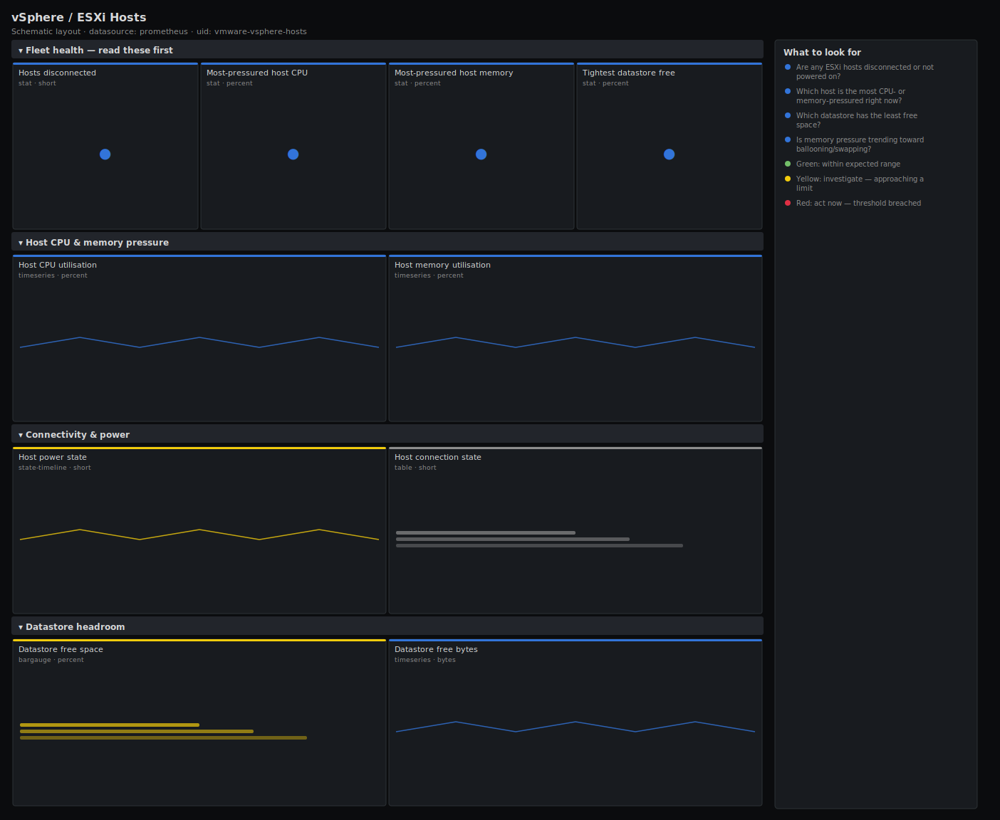

# vSphere / ESXi Hosts

> CPU and memory pressure, power and connection state, and datastore headroom for ESXi hosts scraped by the pryorda vmware_exporter. Answers "which host or datastore is about to run out of room, and is anything disconnected?" rather than dumping raw vCenter counters.

**Primary search phrase:** vSphere ESXi hosts Grafana dashboard  
**Category:** `vmware` · **UID:** `vmware-vsphere-hosts` · **Datasource:** Prometheus



## Questions this dashboard answers

- Are any ESXi hosts disconnected or not powered on?
- Which host is the most CPU- or memory-pressured right now?
- Which datastore has the least free space?
- Is memory pressure trending toward ballooning/swapping?
- Do we have headroom to absorb a host failure (HA)?

## Production lessons — why this dashboard exists

In a vSphere cluster the numbers that ruin your weekend are **a disconnected host** (its VMs may be down or stranded) and **a datastore filling up** (VMs pause or fail to power on, and snapshots can wedge the whole datastore). Host CPU rarely causes incidents on its own, but memory does — once usage approaches the host max, the hypervisor balloons and then swaps guest memory to disk and everything on that host slows to a crawl. This dashboard leads with connectivity and the single tightest host/datastore so you triage capacity before it bites, and keeps enough headroom for HA to restart a failed host's VMs.

## Data source requirements

- **Prometheus** datasource (selected at import time via `${DS_PROMETHEUS}`).
- `vmware_exporter` (pryorda) pointed at vCenter (`vmware_host_cpu_usage`, `vmware_host_cpu_max`, `vmware_host_memory_usage`, `vmware_host_memory_max`, `vmware_host_power_state`, `vmware_host_connection_state`, `vmware_datastore_capacity_size`, `vmware_datastore_freespace_size`).
- Series carry `host_name`, `cluster_name` and `dc_name` labels; datastore series carry `ds_name`. **State mapping assumption:** this dashboard treats `vmware_host_connection_state == 1` as *connected* and `vmware_host_power_state == 1` as *poweredOn*; if your exporter build uses a different encoding, adjust the comparisons and value mappings.

## Template variables

| Variable | Label | Type | Purpose |
|----------|-------|------|---------|
| `${cluster}` | Cluster | query | vSphere cluster(s) to display. |
| `${host}` | Host | query | ESXi host(s) to display; supports multi-select. |

## Panels

### Fleet health — read these first

- **Hosts disconnected** (stat, `short`) — ESXi hosts whose connection state is not "connected" — their VMs may be stranded.
- **Most-pressured host CPU** (stat, `percent`) — Highest host CPU utilisation (usage ÷ max) across the selection.
- **Most-pressured host memory** (stat, `percent`) — Highest host memory utilisation (usage ÷ max). Approaching 100% means ballooning then swap.
- **Tightest datastore free** (stat, `percent`) — Lowest free-space percentage across all datastores. Below 10% risks VM stuns and failed power-ons.

### Host CPU & memory pressure

- **Host CPU utilisation** (timeseries, `percent`) — Per-host CPU usage as a percent of capacity. Sustained highs limit vMotion and HA headroom.
- **Host memory utilisation** (timeseries, `percent`) — Per-host memory usage as a percent of capacity — the panel that predicts ballooning and swap.

### Connectivity & power

- **Host power state** (state-timeline, `short`) — Power state over time (1 = poweredOn). Unexpected transitions point at host failures or maintenance.
- **Host connection state** (table, `short`) — Current connection state per host (1 = connected). Anything else needs immediate attention.

### Datastore headroom

- **Datastore free space** (bargauge, `percent`) — Free-space percentage per datastore — the lowest bars are your snapshot/clone risk.
- **Datastore free bytes** (timeseries, `bytes`) — Absolute free space per datastore over time — projects the day you run out.

## Import

**Grafana UI** — *Dashboards → New → Import*, upload `dashboards/vmware/vsphere-hosts.json`, then pick your datasource when prompted.

**API:**

```bash
scripts/import-dashboard.sh dashboards/vmware/vsphere-hosts.json
```

**Provisioning** — drop the JSON into a provisioned folder (see [provisioning guide](../../provisioning.md)).

## Recommended alerts

Ready-to-use rules ship in `alerts/vmware.rules.yml`.

### VsphereHostDisconnected (`critical`)

```promql
vmware_host_connection_state != 1
```

- **Fires after:** `5m`
- **Why it matters:** A disconnected host means its VMs are unmanaged and possibly down; HA may not protect them and vMotion is impossible.
- **Investigate:** Check the host in vCenter (notResponding vs disconnected); ping the management interface and the hostd/vpxa agents.
- **Recovery:** Clears when the host's connection state returns to 1.
- **False positives:** Planned host maintenance — silence the rule for hosts you have intentionally placed in maintenance mode.

### VsphereHostMemoryPressure (`warning`)

```promql
100 * vmware_host_memory_usage / clamp_min(vmware_host_memory_max, 1) > 95
```

- **Fires after:** `15m`
- **Why it matters:** Above ~95% the hypervisor balloons and then swaps guest memory to disk, slowing every VM on the host and breaking HA headroom.
- **Investigate:** Open vSphere / ESXi Hosts; identify the heaviest VMs on the host and check for memory overcommit across the cluster.
- **Recovery:** Clears when host memory utilisation falls below 95% for 10m.
- **False positives:** Transient spikes during DRS migrations or backups — the 15m `for` filters most of them.

### VsphereDatastoreLow (`critical`)

```promql
100 * vmware_datastore_freespace_size / clamp_min(vmware_datastore_capacity_size, 1) < 10
```

- **Fires after:** `10m`
- **Why it matters:** A near-full datastore stuns running VMs, blocks power-ons and can wedge on a growing snapshot — a cluster-wide hazard.
- **Investigate:** Find large/orphaned VMDKs and old snapshots on the datastore; check for runaway snapshot growth.
- **Recovery:** Clears when free space rises above 10% for 10m.
- **False positives:** Datastores intentionally run hot (scratch/temp) — exclude them by `ds_name`.

## Troubleshooting

| Symptom | Likely cause | First action |
|---------|--------------|--------------|
| Utilisation panels show >100% or divide errors | A `*_max` series briefly reported 0 during exporter startup. | The `clamp_min(..., 1)` guard handles this; if it persists, check the exporter's vCenter permissions for host stats. |
| Disconnected count is non-zero but hosts look fine | Your exporter encodes connection state differently (e.g. 0 = connected). | Verify the value mapping and adjust the `!= 1` comparison to match your build. |
| No datastore panels | The exporter's datastore collector is disabled. | Enable datastore collection in the vmware_exporter config and confirm `vmware_datastore_capacity_size` is scraped. |

## Performance considerations

vCenter performance counters update on ~20s/1m intervals, so a 1m refresh and a 6h window are plenty — scraping faster just hammers vCenter. Per-host series are bounded by `cluster_name`/`host_name`; datastore panels are instant queries. On large vCenters, scope `$cluster` to keep the host count manageable.

## Customization

Tune the 95% memory and 10% datastore thresholds to your overcommit and snapshot policies. To reserve N+1 HA headroom, lower the host CPU/memory warning levels so one host can absorb another's VMs. Add a `dc_name` template variable if you run multiple datacenters behind one vCenter.

## Related resources

- [Advanced observability guides](https://devopsaitoolkit.com/guides/)
- [Grafana & Prometheus tutorials](https://devopsaitoolkit.com/blog/)
- [AI Incident Response Assistant](https://devopsaitoolkit.com/dashboard/incident-response)
- [PromQL cookbook](../../../promql/README.md) · [Alerting guide](../../alerting.md) · [Dashboard catalog](../../catalog.md)
