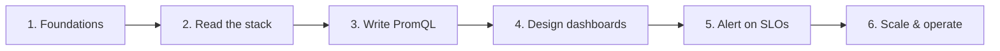

# Observability learning path

A structured route from "I can read a graph" to "I design SLO-grade dashboards and
alerts." Each stage points at the dashboards, docs and PromQL in this repo so you
learn on real, production-shaped material.

## 1. Foundations — the data model

- Metric types: counter, gauge, histogram, summary.
- Why you `rate()` a counter and never a gauge.
- Read: [promql/fundamentals.md](../promql/fundamentals.md),
  [prometheus-setup.md](./prometheus-setup.md).
- Do: stand up node_exporter + Prometheus, import `linux/cpu` and `linux/memory`.

## 2. Read the stack — USE & RED

- USE (resources) vs RED (services); the four golden signals.
- Read: [dashboard-design.md](./dashboard-design.md).
- Do: walk `node-exporter/host-use-method` (USE) and `kubernetes/apiserver` (RED).
  For each panel, say out loud what question it answers.

## 3. Write PromQL — from selectors to joins

- Selectors → aggregation → histograms → vector matching.
- Read: [promql/aggregations-and-joins.md](../promql/aggregations-and-joins.md),
  [promql/histograms-and-latency.md](../promql/histograms-and-latency.md).
- Do: reproduce three panels from `kubernetes/workload-resources` in Explore, then
  modify them (change the aggregation label, the rate window).

## 4. Design dashboards — answer questions

- Lead with the headline signal; meaningful units; justified thresholds; templating.
- Read: [authoring-specs.md](./authoring-specs.md), [variables.md](./variables.md),
  [transformations.md](./transformations.md).
- Do: `scripts/new-dashboard.sh` a dashboard for a system you run, `make build`,
  iterate until it answers your top three operational questions.

## 5. Alert on SLOs — signal, not noise

- `for:`, symptom-based alerts, multi-window burn rates, dead-man's switches.
- Read: [alerting.md](./alerting.md),
  [promql/alerting-patterns.md](../promql/alerting-patterns.md).
- Do: deploy the generated `alerts/` rules; tune one threshold to your environment
  and justify it.

## 6. Scale & operate — keep it fast and honest

- Recording rules, cardinality control, capacity forecasting with `predict_linear`.
- Read: [performance.md](./performance.md),
  [promql/capacity-and-saturation.md](../promql/capacity-and-saturation.md),
  [recording-rules/](../recording-rules/).
- Do: back a slow panel with a recording rule; build a "days to full" capacity panel.

## Where to go next

- The full [dashboard catalog](./catalog.md) — pick the systems you run.
- The [troubleshooting flowchart](./troubleshooting-flowchart.md) for incidents.
- Deeper, AI-assisted guides: <https://devopsaitoolkit.com/guides/>.
