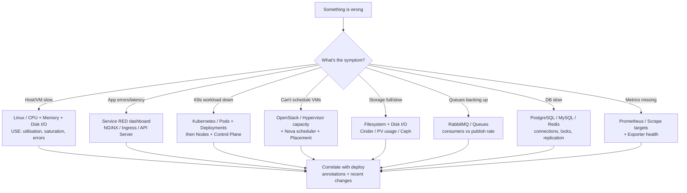

# Troubleshooting flowchart

Two flowcharts: one for **"my dashboard shows no/wrong data"**, and one for
**"production is on fire — which dashboard do I open?"**

## Dashboard shows no data

```mermaid
flowchart TD
    A[Panel shows No data] --> B{Other panels<br/>on this dashboard work?}
    B -- No --> C{Datasource selected?}
    C -- No --> C1[Set the datasource<br/>at the top of the dashboard]
    C -- Yes --> D{up{job=&quot;$job&quot;} == 1<br/>in Explore?}
    D -- No --> D1[Exporter not scraped:<br/>fix scrape_config / target down]
    D -- Yes --> E[Datasource reachable but<br/>metric missing — see right branch]
    B -- Yes --> F{Does the metric exist?<br/>type the bare metric in Explore}
    F -- No --> F1[Wrong exporter or version:<br/>check the dashboard's<br/>Data source requirements]
    F -- Yes --> G{Variable match?}
    G --> G1[Use =~ not = with<br/>multi-value vars]
    G --> G2[Set $job/$instance to All]
    G --> G3[Check label names match<br/>your relabeling]
    F1 --> H[Still stuck? open an issue<br/>with the panel + Explore output]
```

## Production incident — where to look first



## The "what changed in the last hour" reflex

Most incidents follow a change. On any dashboard, narrow the time range to `now-1h`,
look for the step, and line it up with deploy [annotations](./annotations.md). The
quick PromQL for "what moved":

```promql
topk(20, (rate(:metric:[5m]) - rate(:metric:[5m] offset 1h)))
```

See [promql/troubleshooting-queries.md](../promql/troubleshooting-queries.md) for a
full kit of incident queries.
